# Hi, I'm nitikhon 👋

I am a Senior Computer Science student at Chiang Mai University, graduating in March 2026. With
hands-on backend development experience from my internship and personal projects, I am seeking a
Junior level Software Engineer or Backend Developer position. I am eager to apply my skills to contribute
to real-world projects and deliver high-quality software solutions.

---

# Connect
- [linkedin](https://linkedin.com/in/nitikhon)
- [email](mailto:nitikhon.chantatham@example.com)

---

# Stack

**languages**

**backend**

**frontend**

**database & caching**

**tools**

---

<table>
  <tr>
    <td></td>
    <td></td>
  </tr>
</table>
